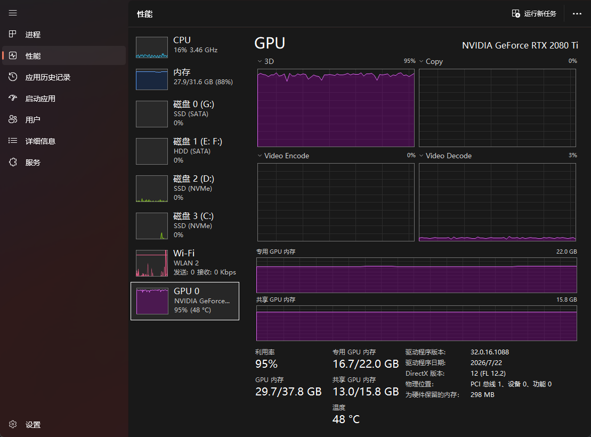
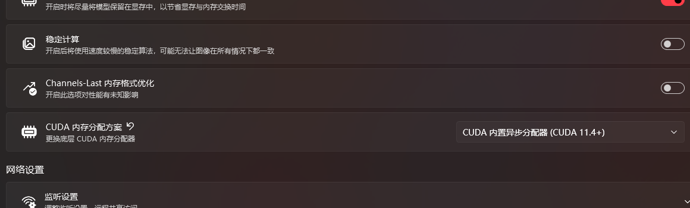
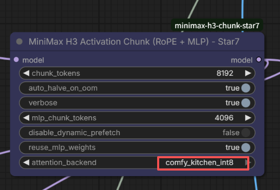
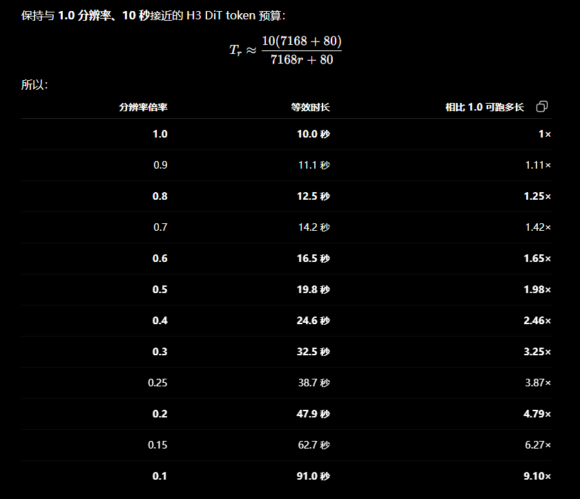

# RTX 2080 Ti 22GB Case Study

This document records one local Windows/ComfyUI case. It is evidence for configuration planning, not a universal benchmark.

## Reproducible configuration

| Item | Value |
|---|---|
| GPU | NVIDIA GeForce RTX 2080 Ti, 22GB modified-memory board |
| Launcher memory policy | Keep models resident in VRAM enabled |
| Other launcher options | Stable computation off; Channels-Last off; CUDA built-in async allocator selected |
| Task | MiniMax H3 single-reference mode; one reference image connected |
| Case A | 1.0MP portrait, 10 seconds, 24fps, approximately 243 frames |
| Case B | 0.6MP portrait, 15 seconds, 24fps, approximately 362 frames |
| Case C | 0.4MP portrait, 10 seconds, 24fps, approximately 243 frames |
| Case D | 0.4MP portrait, 5 seconds, 24fps, approximately 124 frames |
| Reference conditioning | [T8mars/comfyui-minimax-h3-audio-T8](https://github.com/T8mars/comfyui-minimax-h3-audio-T8), one reference image |
| DiT | INT8 Tensorwise + ConvRot MiniMax H3 FL2VA |
| Text encoder | Qwen3-VL 32B MiniMax H3 INT4 ConvRot |
| Video VAE | MiniMax H3 video VAE INT8 ConvRot |
| Audio VAE | MiniMax H3 audio VAE FP32 |
| LoRA | MiniMax H3 FL2V Turbo 4-step v1.0 768p, strength 1.0 |
| Sampling | Euler, simple scheduler, 4 steps, denoise 1.0 |
| Chunking | RoPE 8192; MLP 4096; prefetch enabled; automatic MLP weight strategy |
| Attention | Comfy Kitchen INT8 |
| Output | RTX Video Super Resolution 2× Ultra; NVENC H.264 at 35Mbps |

## Timing

| Attention path | Observed sampling time |
|---|---:|
| KJNodes custom SM75 SageAttention 2 path | approximately 170 seconds/step |
| KJNodes Low VRAM Attention, `head_chunks=4` | approximately 177 seconds/step |
| Comfy Kitchen INT8 | approximately 120 seconds/step |

Compared with the observed [KJNodes](https://github.com/kijai/ComfyUI-KJNodes) custom SM75 SageAttention 2 path, CK INT8 reduced step time by approximately `50s`, or `29.4%`, and raised step throughput by approximately `1.42×`. Compared with Low VRAM Attention it reduced step time by approximately `57s`, or `32.2%`, for approximately `1.48×` throughput. This is a Turing/SM75 result for the recorded local software stack, not a claim that CK is faster than Sage on every GPU architecture.

The four denoising steps of the 1.0MP/10-second case account for approximately 480 seconds. The currently confirmed end-to-end results are:

| Case | Confirmed complete task time |
|---|---:|
| 1.0MP, 10 seconds, 4-step Turbo LoRA | approximately 620 seconds |
| 0.6MP, 15 seconds, 4-step Turbo LoRA | approximately 530 seconds |
| 0.4MP, 10 seconds, 4-step Turbo LoRA | approximately 180 seconds |
| 0.4MP, 5 seconds, 4-step Turbo LoRA | approximately 85 seconds |

These totals include the current workflow's setup, decoding, super-resolution, audio work, and video output. Post-processing is still being tuned. Because the four cases use different spatial and temporal budgets, their total times are reported as observations rather than a linear speed comparison.

## Scaling model

Let `S` be the packed H3 sequence length. A useful engineering approximation is:

```text
S ≈ S_condition + k × spatial_tokens × temporal_tokens
T ≈ T_fixed + aS + bS² + T_post
```

RoPE, normalization, projections, and MLP work are primarily linear in `S`. Full self-attention includes QK/AV work that is approximately quadratic in `S`; memory-efficient kernels reduce residency but do not remove all attention arithmetic. VAE, super-resolution, and encoding add a separate component that is approximately proportional to pixels times frames plus fixed overhead.

The A/C spatial-duration budget ratio is approximately `2.5×`, while the observed end-to-end time ratio is `620/180 ≈ 3.44×`. The C/D budget ratio is approximately `2×`, while the time ratio is `180/85 ≈ 2.12×`. These observations are consistent with a mixture of fixed, linear, quadratic-attention, and post-processing costs rather than one constant linear multiplier.

Activation chunking does not reduce theoretical FLOPs. If a workload already fits dedicated VRAM without allocator pressure or host-memory migration, chunking alone should not be expected to improve speed and can add small-GEMM/kernel-launch overhead. The recorded 170-to-120 seconds/step improvement came primarily from selecting CK INT8 instead of the custom SM75 SageAttention 2 path.

## VRAM tuning decision guide

| Failure point | Primary control |
|---|---|
| eager split-half RoPE | reduce `chunk_tokens` |
| `fc1`/SwiGLU/`fc2` activation | reduce `mlp_chunk_tokens` |
| next-block prefetch | set `disable_dynamic_prefetch=true` |
| QKV/attention | change or chunk the attention backend |
| model loading | loader, quantization, or offload policy; chunk values do not apply yet |

| Dedicated VRAM | RoPE start | MLP start | Prefetch |
|---:|---:|---:|---|
| 20–24GB | 8192 | 4096 | enabled first; disable after OOM |
| 16–20GB | 8192 | 2048–4096 | enabled; lower MLP first |
| 12–16GB | 8192 | 1024–2048 | enabled; lower RoPE only on RoPE OOM |
| below 12GB | 4096–8192 | 512–1024 | enabled; long-video success is not guaranteed |

## Memory observation

The captured single-reference run showed approximately `16.7 / 22.0GB` dedicated GPU memory, about `13.0 / 15.8GB` shared GPU memory mapped by Windows, approximately 95% GPU utilization, and near-zero Copy-engine activity at the instant of capture.



A separate no-reference text-to-video run was reported at approximately 15.6GB dedicated VRAM. These values are snapshots, not peak-memory traces. The data supports “no sustained copy-engine bottleneck was observed”; it does not support a claim that Windows never mapped or accessed shared memory.



The “keep models resident in VRAM” option reduces model swapping. It does not disable WDDM shared-memory mapping and should not be described as a zero-shared-memory guarantee.

## Node settings



```text
chunk_tokens = 8192
mlp_chunk_tokens = 4096
auto_halve_on_oom = true
disable_dynamic_prefetch = false
reuse_mlp_weights = true  # auto-detects resident vs streamed safely
attention_backend = comfy_kitchen_int8
```

## Fixed-token-budget duration estimate

For rough planning only, if `r` is the spatial pixel/token budget relative to the 1.0MP case, the recorded approximation was:

```text
T_r ≈ 10 × (7168 + 80) / (7168r + 80)
```

| Relative spatial budget `r` | Estimated equivalent duration | Relative to 1.0MP/10s |
|---:|---:|---:|
| 1.0 | 10.0s | 1.00× |
| 0.9 | 11.1s | 1.11× |
| 0.8 | 12.5s | 1.25× |
| 0.7 | 14.2s | 1.42× |
| 0.6 | 16.5s | 1.65× |
| 0.5 | 19.8s | 1.98× |
| 0.4 | 24.6s | 2.46× |
| 0.3 | 32.5s | 3.25× |
| 0.25 | 38.7s | 3.87× |
| 0.2 | 47.9s | 4.79× |
| 0.15 | 62.7s | 6.27× |
| 0.1 | 91.0s | 9.10× |



This table estimates sequence-budget equivalence. It does not guarantee that the model, VAE, conditioning implementation, or available VRAM supports the listed duration, and it does not predict wall-clock time linearly.

## Interpretation limits

- Tests were local observations rather than a multi-run statistical benchmark.
- The 22GB board is not representative of a stock 11GB RTX 2080 Ti.
- CK INT8 and Sage are approximate attention paths and can produce different pixels.
- Chunking reduces peak activation residency; it does not reduce theoretical GEMM FLOPs.
- Performance comparisons require identical model, LoRA, seed, resolution, frame count, steps, backend, and offload state.
